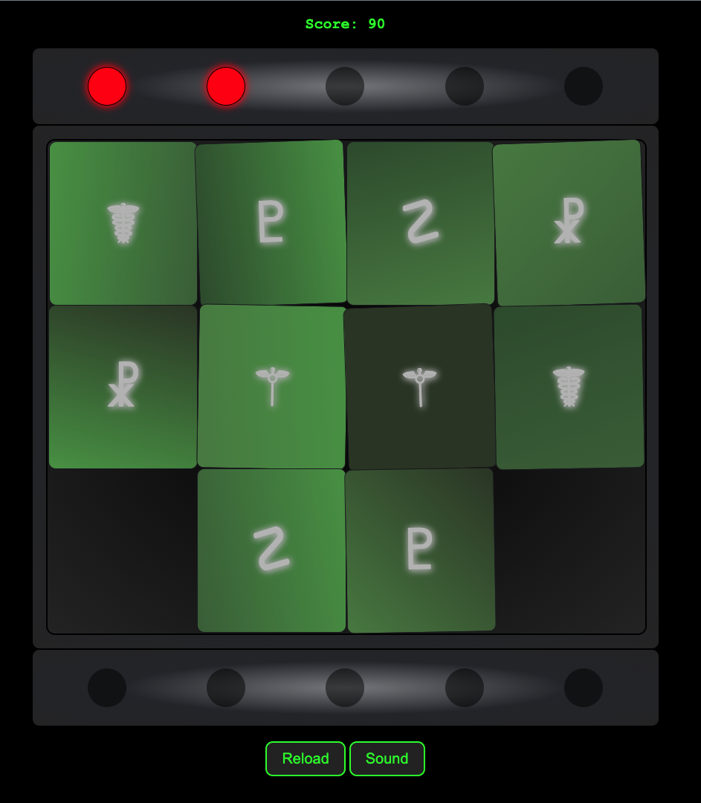

# Containment Protocol

Containment Protocol is an interactive memory game where the player must match pairs of symbols to prevent a reactor meltdown. The game features a retro, terminal-like interface and provides an engaging challenge with increasing difficulty.

## Table of Contents

- [How to Play](#how-to-play)
- [Features](#features)
- [Further Development](#further-development)
- [Technologies Used](#technologies-used)
- [License](#license)

## How to Play

1. **Start the Game:**
   - Click on the **"Instructions"** button on the overlay to view the game instructions.
   - After reading the instructions, press the **"Start"** button to begin the game.

2. **Objective:**
   - Your goal is to find matching pairs of symbols on the grid. Each match will turn on a green light, indicating that you've deactivated a faulty system.
   - If you select two cards that don't match, a red light will turn on, indicating a mistake. You have a limited number of chances before the reactor goes into meltdown.

3. **Winning the Game:**
   - Successfully match all pairs on the grid to move to the next level.
   - The difficulty increases with each level as more cards are added to the grid.

4. **Game Over:**
   - The game ends if you make too many incorrect matches. Your final score will be displayed, and you can restart the game by clicking the **"Reload"** button.

## Features

- **Dynamic Grid:** The grid dynamically adjusts based on the number of cards.
- **Retro Design:** A terminal-like UI with glowing text and pixel-perfect alignment.
- **Sound Effects:** Includes ambient background sounds and sound effects that enhance the gaming experience.
- **Progressive Difficulty:** Each level adds more cards, increasing the challenge.

## Further development

- **Responsive design** Need some further work on the responsiveness of different screen sizes.
- **New Challenges** Need some further work to add more challenges besides the memory puzzle.
- **Switching Themes** Need some further work to be able to change out the theme of the story and style.

## Technologies Used

- **HTML5:** Structure of the game.
- **CSS3:** Styling, including a responsive design that adapts to different screen sizes.
- **JavaScript:** Game logic, including dynamic grid generation, event handling, and game state management.

## License

This project is licensed under the MIT License.
